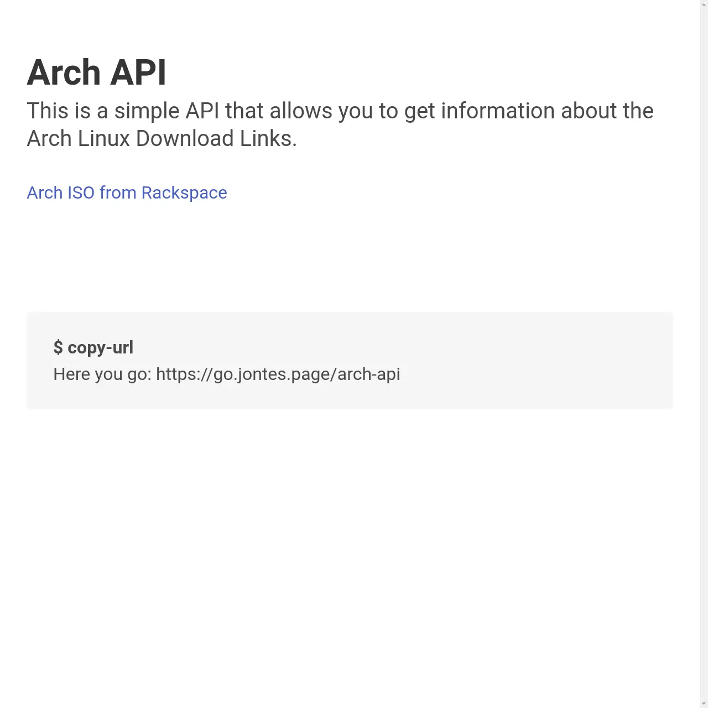

# Jonte's APIs
You have arrived at the Git repo for Jonte's APIs, such as the one for fetching the URL for the latest Arch Linux ISO. 

## Arch Linux API:

This API is the only one currently in service. Its endpoint is [/api/arch-rackspace-latest](https://api.jontehosted.tk/api/arch-rackspace-latest), but the demo is [here](https://jontes.page/api/arch).